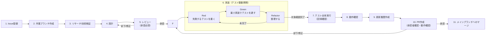

# 開発フロー（必須プロセス）

本リポジトリでの変更作業は、必ず以下の工程をこの順序で進めること。
途中省略・順序入替は禁止。特に **設計レビュー** と **PRレビュー** は承認者の確認・承認を必須とし、
承認が得られるまで次工程へ進んではならない。
また実装（6.）は **テスト駆動開発（TDD）** で行い、テストを書く前にプロダクションコードを実装してはならない。

## 1. Issue登録

- 対応内容（背景・目的・期待する結果・影響範囲）を明文化し、Issueとして登録する。
- 不具合修正の場合は再現手順・期待動作・実際の動作を含める。

## 2. 作業ブランチ作成

- `main` から作業ブランチを作成する。
- ブランチ名は `feature/<issue番号>-<概要>` または `fix/<issue番号>-<概要>` 形式を推奨。
- 作業内容をIssue番号と紐付けられるようにする。

## 3. リサーチ・技術検証

- 既存実装（[docs/detailed-design.md](docs/detailed-design.md) 等）を確認し、影響範囲を把握する。
- 未知の技術要素（新規ライブラリ・API仕様等）は事前に検証し、実現可能性を確認する。
- 調査・検証結果は**設計書類として** [docs/research/](docs/research/README.md) に
  `docs/research/<Issue番号>-<調査テーマ>.md` の形式で必ず記録する（テンプレートは同README参照）。
  チャットでの回答のみで終わらせず、ファイルとして残す。

## 4. 設計

- 変更内容に応じて [docs/detailed-design.md](docs/detailed-design.md)（詳細設計書）を更新、
  または変更範囲が大きい場合は個別の設計メモを作成する。
- モジュール構成・データフロー・エラーハンドリング方針など、実装に影響する設計判断を明記する。
- 3.で作成した調査ドキュメント（docs/research/配下）を根拠として相互参照する（設計書側から
  調査ドキュメントへのリンク、調査ドキュメント側の「結論・採用方針」から設計書該当箇所へのリンク）。

## 5. レビュー（承認必須）

- 設計内容をレビュー依頼者（私）に提示し、**明示的な承認を得るまで実装に着手しない**。
- 指摘があった場合は設計を修正し、再度レビューを受ける。

## 6. 実装（テスト駆動開発 / TDD）

承認された設計に基づき、**必ずテストを先に書いてから実装する**（Red→Green→Refactor）。
いきなり実装コードから書き始めることは禁止。

1. **Red**: 対象の仕様・不具合修正内容に対する、まだ通らないテストを書く。
2. **Green**: そのテストが通る最小限の実装を行う。
3. **Refactor**: テストが通る状態を保ったまま、コードを整理する。
4. 対象範囲の実装が完了するまで 1〜3 を繰り返す。

- テストは Vitest を使用する。テストファイルはテスト対象と同じディレクトリに
  `<対象ファイル名>.test.ts` として配置する（例: `src/las/format.ts` → `src/las/format.test.ts`）。
- 実行コマンド: `npm run test`（一括実行） / `npm run test:watch`（監視実行、TDDサイクル中に使用）。
- DOM/three.js等ブラウザAPIに依存し単体テスト化が困難な箇所は、関数分割してロジック部分のみテスト可能にする。
  それでも困難な場合はテスト省略の理由を設計またはPRに明記する。
- 実装中に設計との乖離が生じた場合は、設計に立ち戻り再レビューを依頼する。

## 7. テスト全体実行（回帰確認）

- `npm run test` で単体テストを全件実行し、既存テストを含め全て成功することを確認する。
- `npm run build`（`tsc --noEmit && vite build`）で型チェック・ビルドが通ることを確認する。

## 8. 動作確認

- 実際にビューアを起動し、変更箇所が意図通りに動作することを確認する（`npm run dev` / `npm run preview`）。
- 影響を受けうる既存機能についても退行がないか確認する。

## 9. 更新履歴作成

- [CHANGELOG.md](CHANGELOG.md) に変更内容を追記する（日付・概要・関連Issue番号）。

## 10. PR作成（承認者によるPR内容確認・動作確認）

- 変更内容・テスト結果・動作確認結果をPR説明に記載する。
- 承認者がPR内容の確認および動作確認を行い、承認するまでマージしない。

## 11. メインブランチへのマージ

- 承認後、`main` ブランチへマージする。
- マージ後は作業ブランチを削除する。
