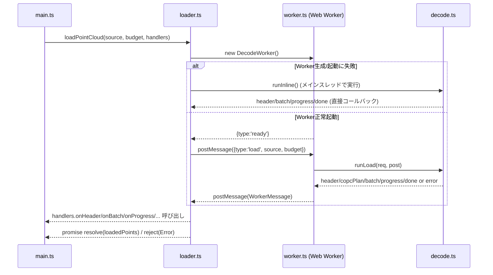
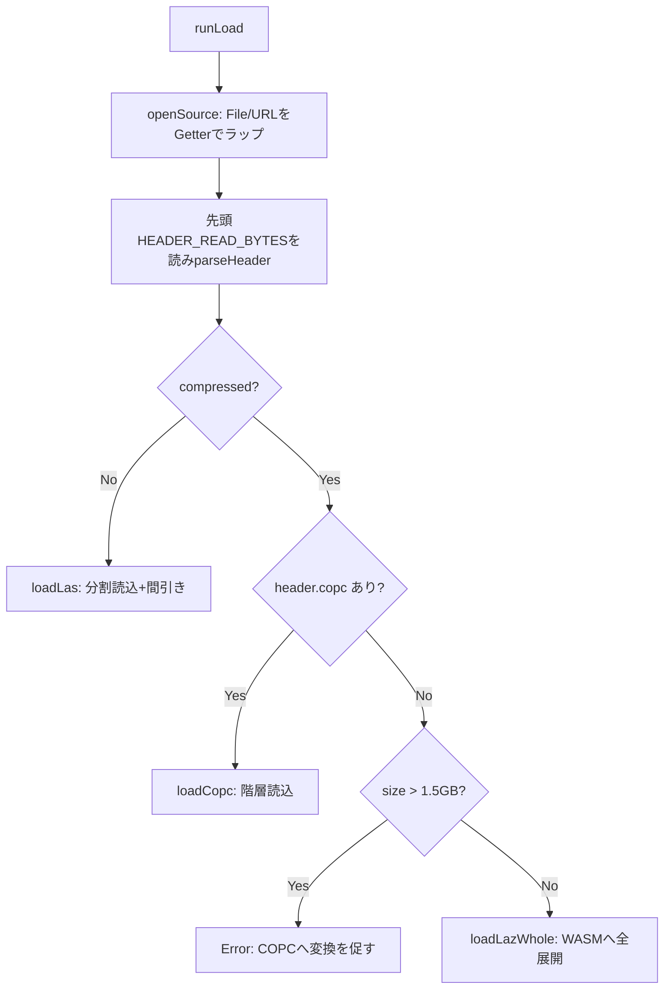
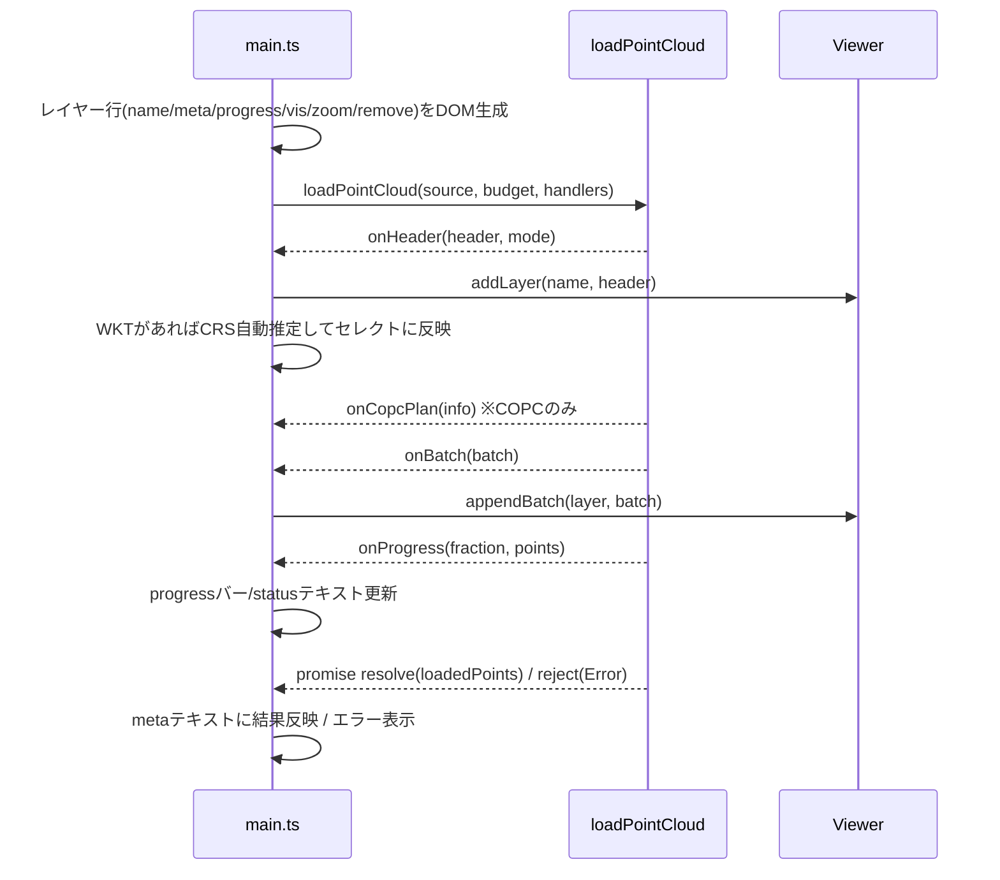
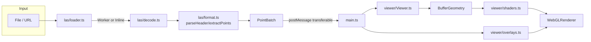

# 点群ビューア 詳細設計書

## 1. 文書の位置付け

本書は `src/` 配下の実装（2026-09 時点のソースコード）から起こした詳細設計書である。
モジュール構成、データ構造、処理フロー、シーケンスをコードと対応付けて記述する。
システム全体の目的・機能一覧・非機能要件・画面構成は
[docs/basic-design.md](basic-design.md)（基本設計書）を参照。
利用者向けの操作説明・ビルド手順は [README.md](../README.md) を参照。

## 2. システム概要

ブラウザ単体（サーバー不要）で動作する LAS / LAZ / COPC 点群ビューア。
`vite-plugin-singlefile` により `dist/index.html` 1 ファイルへバンドルされ、
JS・WASM（laz-perf）・Worker をすべて内包する。

### 2.1 技術スタック

| 区分 | 技術 |
|---|---|
| 描画 | three.js（`WebGLRenderer` + カスタム `ShaderMaterial`） |
| 点群展開 | laz-perf（WASM 版 LASzip） |
| 座標変換 | proj4 |
| ビルド | Vite + TypeScript（`tsc --noEmit && vite build`） |
| 並列処理 | Web Worker（`?worker&inline` でバンドルに内包） |

### 2.2 ディレクトリ構成と責務

```
src/
  main.ts            画面組み立て・イベント配線（エントリポイント）
  ui.ts              DOM生成の小ヘルパー（フレームワーク不使用）
  vite-env.d.ts       Vite用の型宣言
  las/
    format.ts        LASヘッダ/VLR/点レコードのパーサ、バッチビルダー
    messages.ts      Worker⇔メインスレッド間のメッセージ型定義
    worker.ts         Workerエントリ（decode.tsを呼び出すだけ）
    loader.ts         Workerの起動・フォールバック制御ラッパー
    decode.ts         読み込みコア処理（LAS分割/LAZ全展開/COPC階層読込）
  viewer/
    Viewer.ts         three.jsシーン管理、レイヤー、ピッキング、計測、視点制御
    shaders.ts        点描画用GLSLシェーダと共有ユニフォーム
    crs.ts            日本の座標系定義とWKTからの推定
    overlays.ts        地図タイル/3Dモデル/写真の重ね合わせ
    WalkControls.ts    ウォークスルー（一人称視点）操作
scripts/
  make_sample.py      動作確認用サンプルLAS/LAZ生成スクリプト
```

## 3. モジュール詳細設計

### 3.1 `las/format.ts` — LASヘッダ・点データの解析

#### 3.1.1 `LasHeader` インターフェース

LASヘッダから抽出する情報。バイナリオフセットは LAS 1.0〜1.4 仕様に準拠。

| フィールド | 内容 |
|---|---|
| `versionMajor/Minor` | LASバージョン |
| `pointFormat` | 点レコードフォーマット（PDRF）。圧縮ビット(0x80)を除去した値 |
| `compressed` | rawFormatの0x80ビットで判定（LAZ形式か） |
| `pointCount` | 1.4以降は64bit値（`evlrOffset`近傍）を優先採用 |
| `scale`/`offset` | 整数座標→実座標変換係数 |
| `min`/`max` | 点群のバウンディングボックス（実座標） |
| `copc` | `CopcInfo`（COPC VLRが存在する場合のみ） |
| `wkt` | 座標系のWKT文字列（`LASF_Projection`/recordId=2112のVLR） |

`HEADER_READ_BYTES = 375 + 54 + 160 + 4096` バイトを先読みし、`parseHeader()` で
シグネチャ検証・固定フィールド読み取り・VLR走査（`copc` / WKT）を行う。

#### 3.1.2 `parseHeader(buf): LasHeader`

処理フロー:
1. 先頭4バイトが `LASF` であることを確認（不一致は例外）。
2. `DataView` で固定オフセットから各フィールドを読み取る。
3. `versionMinor >= 4` かつ `headerSize >= 375` の場合、EVLRオフセット/件数と
   64bit点数を読み、`count64 > 0` なら `pointCount` を上書き。
4. `headerSize` 位置から `vlrCount` 件、VLRを順に走査:
   - `userId === 'copc'` かつ `recordId === 1` → `CopcInfo` を構築
   - `userId === 'LASF_Projection'` かつ `recordId === 2112` → WKT文字列を読み取り
5. 構築した `LasHeader` を返す。

#### 3.1.3 `layoutFor(format): FieldLayout`

PDRF（点データフォーマット）ごとにRGB・intensity・classificationのバイトオフセットを返す。

- `format >= 6`: RGBは format 7/8/10 のときオフセット30、classificationは独立バイト(オフセット16)
- `format < 6`: RGBは format 2 → offset20、format 3/5 → offset28。classificationはoffset15で下位5bitのみ使用（`classIsPdrf6=false`）

#### 3.1.4 `extractPoints(src, n, header, stride, startIndex, out)`

生の点レコード配列から `stride` 間隔で間引きながら座標・色・強度・分類を取り出し、
`PointBatchBuilder` へpushする。

- 座標は `整数値 * scale + offset - header.min` で「ファイルminを原点とした相対座標」に変換（float32格納で精度劣化を回避）。
- `startIndex % stride` で位相を合わせ、チャンク境界をまたいでも均等間引きが崩れないようにする。
- RGBが無いフォーマットは `r=g=b=255`（白）を設定。

#### 3.1.5 `PointBatchBuilder`

固定容量（`BATCH = 262,144`点）のTypedArrayに蓄積し、満杯になったら`onFlush`コールバックで
`PointBatch`（position/color/intensity/classification の各TypedArray）を発行する。
`maxColor` を追跡し、RGBが16bit値（>255）かどうかの判定に使う。

### 3.2 `las/messages.ts` — Worker通信プロトコル

`WorkerMessage` はタグ付きユニオン型で、Worker→メインスレッドの通知種別を表す。

| type | 意味 |
|---|---|
| `ready` | Worker起動完了（メインスレッドでのフォールバック判定に使用） |
| `warn` | 警告（例: 点数をファイルサイズから補正した等） |
| `header` | ヘッダ解析完了、`mode`（las/laz/copc）を通知 |
| `copcPlan` | COPC読み込み計画（使用ノード数・最大レベル）を通知 |
| `batch` | 点群バッチ（Transferableで転送） |
| `progress` | 進捗率と読み込み済み点数 |
| `done` | 完了、最終読み込み点数 |
| `error` | 例外発生、メッセージ文字列 |

### 3.3 `las/loader.ts` — Worker起動とフォールバック制御

`loadPointCloud(source, budget, handlers): { promise, cancel }`



フォールバック判定ロジック:
- `new DecodeWorker()` 自体が例外を投げた場合 → 即座にメインスレッドで `runLoad()` を実行。
- Worker起動後、`ready` 受信前に `onerror` が発火した場合 → CSP等でWorkerが機能しない環境と判断し、
  メインスレッドにフォールバック。
- `ready` 受信後にエラーが起きた場合 → メモリ不足等とみなし、reject（フォールバックしない）。

`cancel()` は `cancelled` フラグを立てて以降のメッセージ処理を抑止し、Workerを`terminate()`する。

### 3.4 `las/worker.ts` — Workerエントリ

`self`をWorkerとして扱い、`runLoad()`を呼び出すだけの薄いラッパー。
起動直後に `{type:'ready'}` を送信し、`error`/`unhandledrejection` を捕捉して
`WorkerMessage`化することで、`file://` 環境でも詳細なエラー内容をメインスレッドへ伝える。

### 3.5 `las/decode.ts` — 読み込みコア

3つの読み込みモードを `header` から判定し分岐する（`runLoad()`）。



#### 3.5.1 `openSource(src): Source`

- `File` の場合: `file.slice(b,e).arrayBuffer()` で範囲読み取り。
- `string`(URL) の場合: `HEAD` リクエストで `content-length` と `accept-ranges` を確認し、
  Range非対応なら例外。`get()` は `Range: bytes=b-e-1` ヘッダ付き`fetch`。

#### 3.5.2 `loadLas()` — 通常LAS（非圧縮）の分割読込

1. `pointLength < 20` または `pointDataOffset >= size` は不正ファイルとして例外。
2. ヘッダの `pointCount` が0または `ファイルサイズから逆算した点数` を超える場合、
   ファイルサイズベースの値に補正（`warn`通知）。
3. `stride = floor(total / budget)` で均等間引き率を決定。
4. `8MB` 相当のレコード数ごとに `source.get()` でチャンク読込 → `extractPoints()` →
   進捗を `progress` で通知、を `index >= total` まで繰り返す。
5. 最後に `builder.flush()` で端数を出力。

#### 3.5.3 `loadLazWhole()` — 通常LAZの全展開

1. `laz-perf` インスタンスを遅延初期化（`wasmBinary`をfetchして`createLazPerf()`）。
2. `_malloc(size)` でWASMヒープを確保し、`64MB`ずつ`HEAPU8.set()`で書き込み（JS側に
   ファイル全体のコピーを作らずピークメモリを抑制）。
3. `LASZip` を`open()`し、`getCount()`/`getPointLength()`から`stride`を算出。
4. `65,536`点ブロック単位で `getPoint()` → `extractPoints()`。8ブロックごとに
   `progress` 通知と `yieldToEventLoop()`（`setTimeout(0)`）でUIブロッキングを回避。
5. `finally` で `blockPtr`/`filePtr`/`zip` を確実に解放。

#### 3.5.4 `loadCopc()` — COPC階層読込

1. ルート階層ページ（`info.rootHierOffset/Size`）から `parseHierarchyPage()` でエントリ抽出。
   `pointCount === -1` のエントリは他ページへの参照であり、`loadPage()` を再帰呼び出し
   （`Promise.all`で並列解決）。
2. 全ノードをレベル（`level`）ごとに集計し、レベルの浅い順に「予算 `budget` に収まるだけ」採用する
   グリーディ計画を立てる（`plan`配列、ノードごとの`stride`を決定）。
   予算を使い切るレベルでは `stride = ceil(lvPoints / remaining)` で追加間引き。
3. `copcPlan` メッセージで採用ノード数・最大レベルを通知。
4. 各ノードについて: 圧縮データ取得 → WASMへ書込 → `ChunkDecoder.open(pointFormat, len, inPtr)` →
   `getPoint()` をノードの点数分繰り返し展開 → `extractPoints()`。4ノードごとに進捗通知＋yield。

### 3.6 `viewer/shaders.ts` — 点描画シェーダ

#### 3.6.1 共有ユニフォーム `SharedUniforms`

全レイヤーの `ShaderMaterial` が同一の値オブジェクト参照を共有するため、
`Viewer` 側で一度設定すれば全レイヤーに反映される（`uMode`, `uPointSize`, `uAttenuate`,
`uScreenHeight`, `uZRange`, `uIntensityRange`, `uGamma`）。

#### 3.6.2 頂点シェーダのロジック

- `uMode` により色計算を分岐:
  - `0`（標高）: ワールドZを`uZRange`で正規化し `turbo()`（多項式近似Turboカラーマップ）を適用。
  - `1`（RGB）: 頂点カラー × `uColorScale`（8bit/16bit自動判定で1または1/257相当）を`uGamma`でガンマ補正。
  - `2`（強度）: `intensity`を`uIntensityRange`で正規化しグレースケール化。
  - `3`（分類）: `classColor()` でASPRS標準分類コードごとに固定色を返す（未分類・地面・植生・建物・水部・道路・電線等）。
- 点サイズ: `uAttenuate` が有効な場合、`-mv.z`（カメラ距離）に応じて減衰させたピクセルサイズを`clamp(1,64)`。

#### 3.6.3 フラグメントシェーダ

`uRound` が有効な場合、`gl_PointCoord` 中心からの距離が0.5を超える画素を`discard`し、
点を丸く描画する。

### 3.7 `viewer/Viewer.ts` — シーン管理の中核

#### 3.7.1 座標系設計（原点相対化）

`origin`（最初に追加したレイヤーの`header.min`、実座標・double精度）を保持し、
`toScene(x,y,z)` / `toWorld(v)` で相互変換する。GPUへ送る座標はすべて `origin` 基準の
float32相対値とすることで、平面直角座標系のような大きな絶対値でも精度劣化を防ぐ。

#### 3.7.2 レイヤー管理

- `addLayer(name, header): Layer` — 初回レイヤーで`origin`を確定。`group.position`を
  `toScene(header.min)`に設定し、`createPointMaterial()`で専用マテリアル（`SharedUniforms`共有）を生成。
  `bounds`（Box3、シーン座標）を拡張し、初回レイヤー追加時のみ`fitCamera()`を呼ぶ。
- `appendBatch(layer, batch)` — `PointBatch`から`BufferGeometry`を都度生成し`THREE.Points`として
  `layer.group`に追加（バッチ単位でGeometryを分割し、逐次描画を可能にする設計）。
  `maxColor > 255` を検出したら初回のみ `uColorScale=1`（16bit値をそのまま0..65535として扱う想定）に切替。
- `removeLayer(layer)` — Geometry/Materialを`dispose()`してから`bounds`を再計算。

#### 3.7.3 視点制御

| メソッド | 内容 |
|---|---|
| `fitCamera(box)` | 対象Boxの中心・対角長からカメラ位置・near/farを自動設定 |
| `setView(kind)` | `top`/`north`/`east`/`iso` の定型視点方向へジャンプ |
| `setWalkMode(on)` | `OrbitControls`⇔`WalkControls`の排他切替。ON時は`near`を0.05へ縮小、OFF時は視線5m先を`OrbitControls.target`に設定して復帰 |
| `startWalkAt(world, eyeHeight)` | クリック点(実座標)に目線高さを加えて一人称視点を開始 |

マウス左ボタン押下（`onPointerDown`）は回転操作の候補かどうか（非ウォークモードかつ
Ctrl/Meta/Shiftキー非押下。押下時は`OrbitControls`側の仕様でパン操作になるため対象外）だけを記録し、
回転候補の場合は`controls.enabled = false`にして`OrbitControls`の入力処理（回転・パン・ズーム）を
一時停止する。

`OrbitControls`は`target`を変更しても`update()`内の計算上カメラの**位置**は変わらないが、
続く`object.lookAt(target)`により**向き**は強制的に`target`の方向（＝画面中央）を向く。
そのためクリック位置が画面中央でない限り、`target`を切り替えた瞬間に必ず視点の向き直りが
発生してしまい、`OrbitControls`の`target`/`lookAt`方式ではクリック位置を画面上で動かさずに
その点を中心として回転を始めることができない（調査: [docs/research/3-rotate-around-cursor.md](research/3-rotate-around-cursor.md)）。
そのため、ドラッグによる回転処理自体を独自実装に置き換えている。

実際に一定px（4px）以上動いた最初の`pointermove`（`onPointerMoveForRotatePivot`）でのみ、
`pointerdown`時点の座標を`pick()`でレイキャストし、ヒットした点を回転中心（`rotatePivot`、
ワールド座標）として記録する。ヒットしない場合は`controls.enabled = true`に戻し、通常の
`OrbitControls`回転（既存の`target`中心）に任せる。ドラッグ中の各`pointermove`
（`rotateAroundPivot(dx, dy)`）では`OrbitControls`を一切介さず、直前のポインタ位置からの
移動量だけを使って、カメラのオフセット（`camera.position - rotatePivot`）を`camera.up`まわりに
ヨー回転、続けてカメラのローカル右方向まわりにピッチ回転し、同じ回転量を`camera.quaternion`にも
適用してからカメラ位置を再計算する。`lookAt()`を呼ばないため、クリックした点が画面中央へ
強制的に移動することはない。独自回転中は`render()`内の`controls.update()`呼び出し自体を
スキップする（`update()`は毎フレーム無条件で`lookAt(target)`を呼ぶため、呼ぶと独自に設定した
向きが上書きされてしまう）。

`onPointerUp`では、独自回転を行っていた場合は`controls.target`を**カメラの現在の正面方向**上の
点に置き直してから（この点は定義上すでに画面中央にあるため`lookAt()`を呼んでも向きは変化しない）
`controls.enabled = true`に戻す。ドラッグに至らなかった単純クリックの場合は`target`を変更せず、
`enabled`を戻すだけとする。

#### 3.7.4 ピッキング（`pick()`）

`Raycaster.params.Points.threshold` を「注視点距離の約6px相当」に動的設定して点群をレイキャスト。
点群ヒットは距離順に整列されないため、最も近いヒット距離から`camDist*0.02`以内の範囲で
`distanceToRay`が最小のヒットを採用する（手前の点を優先しつつレイに最も近い点を選ぶ工夫）。

#### 3.7.5 距離計測

`measureMode`中に2点クリックすると`addMeasurement(a,b)`で線分・ラベル（Canvasテクスチャの
`Sprite`）を生成し、3D距離・水平距離・高低差を`onMeasure`コールバックへ通知する。
ラベル/マーカーは`worldPerPixel()`を用い、画面上で一定ピクセルサイズを保つようフレームごとに
スケール再計算する。

### 3.8 `viewer/WalkControls.ts` — ウォークスルー操作

Z-up前提。`yaw`（Z軸回転）・`pitch`（仰俯角）を内部状態として保持し、`viewDir`から
`camera.lookAt()`で姿勢を反映する。

- `update()`: `keys`（押下中キー集合）とdt（前フレームからの経過秒）から移動量を積分。
  `Shift`で3倍速、水平移動（W/S/A/D）はXY平面上、R/Fで高さのみ変更。
- マウス左ドラッグで`yaw`/`pitch`を直接操作（`0.004 rad/px`）。
- ホイールで視線方向への前後移動。
- `Escape`キーで`onExit`コールバック（`Viewer.setWalkMode(false)`に接続）を発火。
- `isTyping()`でinput/select/textareaへのフォーカス中はキー操作を無視。

### 3.9 `viewer/crs.ts` — 座標系定義

- 平面直角座標系 I〜XIX系の原点緯度経度をハードコードし、`+proj=tmerc`（Transverse Mercator,
  `k=0.9999`）のproj4定義文字列を生成。JGD2011（EPSG:6669〜）とJGD2000（EPSG:2443〜）の
  両方を用意。
- UTM 51〜55帯（JGD2011 / WGS84）とWebメルカトル（EPSG:3857）も定義。
- `Crs`クラス: `proj4(WGS84, def.proj)`で変換器を構築し、`swapXY`（測量座標系のX=北/Y=東）
  設定に応じて`toLocal()`/`toLonLat()`で軸を入れ替える。
- `guessCrsFromWkt(wkt)`: WKT末尾の`ID["EPSG",n]`または`AUTHORITY["EPSG","n"]`から
  EPSGコードを正規表現抽出、一致する定義を返す。系番号のみの場合はJGD2011系から名称一致で推定。

### 3.10 `viewer/overlays.ts` — 重ね合わせ機能

#### 3.10.1 `MapOverlay`

1. `build(crs, source, zScene, margin, maxTiles)` で点群バウンディングボックス（+余白20%）の
   4隅を`crs.toLonLat()`で経緯度化し、包含する経緯度範囲を算出。
2. `maxTiles`（既定64枚）に収まる最大ズームレベルを、`source.maxZoom`から降順に探索して決定。
3. 各タイルは`PlaneGeometry(1,1,6,6)`（6x6分割）を生成し、各頂点をタイル内座標→経緯度→
   `crs.toLocal()`で点群のローカル座標へ逆変換して配置することで、地図投影の歪みに追従させる。
4. `TextureLoader`で非同期にタイル画像を読み込み、読み込み完了後にマテリアルへ反映。

#### 3.10.2 `ModelOverlay`（glb/gltf/obj）

- `GLTFLoader`/`OBJLoader`で読み込み、`inner`グループ（Y-up→Z-up変換用の中間ノード）に格納。
- `centerOnBase(yUp)`: モデルのローカルBoxを計算し、XY中心・Z（またはY-upならY）の最小値を
  原点に合わせることで「底面中心」を基準点にする。
- `setPlacement()`: 実座標→シーン座標変換、スケール、方位角（Z軸回転）、Y-up/Z-up切替
  （`inner.rotation.x = Math.PI/2` or `0`）を適用。

#### 3.10.3 `PhotoOverlay`（jpg/png）

`PlaneGeometry(1,1)`にテクスチャを貼り、`width`と画像アスペクト比から高さを算出。
方位角・傾き・不透明度をプレーンの回転・マテリアル`opacity`に反映する想定
（`setPlacement()`, ファイル末尾は読み取り範囲外だが`MapOverlay`/`ModelOverlay`と同様の
実座標→シーン座標変換パターンに従う）。

### 3.11 `main.ts` — 画面組み立てとイベント配線

DOM要素（`#panel`, `#canvas`, `#status`, `#coord`, `#toolbar`等）を取得し、`Viewer`と
3種の`*Overlay`をインスタンス化した上で、`ui.ts`のヘルパーでセクションごとのUIパネルを
組み立てる。責務ごとに以下のセクションに分割:

| セクション | 主な機能 |
|---|---|
| ファイル | ドラッグ&ドロップ/ファイル選択/URL読込、表示点数上限、レイヤー一覧（可視・ズーム・削除） |
| 表示 | 色分けモード、点サイズ・減衰、標高/強度レンジ、RGBガンマ、背景色 |
| ウォークスルー | 開始/終了、移動・旋回速度、目線高さ |
| 距離計測 | 計測モード切替、結果一覧、消去 |
| 地図の重ね合わせ | 座標系選択、タイル種別、高さオフセット、不透明度 |
| 3Dモデルの重ね合わせ | ファイル読込、位置・倍率・方位角・Y-up設定 |
| 写真の重ね合わせ | ファイル読込、位置・幅・方位角・傾き・不透明度 |

#### 3.11.1 `addSource(source, name)` の処理フロー



- `refreshRanges()`: 標高レンジ入力欄（ユーザー未編集時のみ）や3Dモデル/写真の初期配置座標
  （点群バウンディングボックス中心）を自動更新。
- 「上限を適用して再読込」ボタンは全エントリを`removeEntry()`→`addSource()`で作り直す。

### 3.12 `ui.ts` — DOMヘルパー

フレームワーク不使用で、`el()`（属性・子要素付きDOM生成）、`section()`（`<details>`折りたたみ）、
`slider()`/`numberInput()`/`select()`/`checkbox()`/`button()`/`fileButton()` の各コンポーネントを
関数として提供する。状態はクロージャで保持し、`onChange`コールバックで呼び出し側に通知する
薄いラッパーパターン。

## 4. データフロー図（全体）



## 5. エラーハンドリング方針

| 発生箇所 | 方針 |
|---|---|
| ヘッダ不正（非LAS） | `parseHeader()`で例外→`decode.ts`が`describeError()`で整形→`error`メッセージ |
| 点数0/過大 | ファイルサイズから補正し`warn`で通知（処理は継続） |
| Worker起動不可（CSP等） | `loader.ts`がメインスレッド実行にフォールバック（`onFallback`で画面通知） |
| Worker異常終了（メモリ不足等） | `reject`し、UIで「表示点数上限を下げて再読込」を案内 |
| 通常LAZが1.5GB超 | `decode.ts`が事前に例外化し、COPC変換コマンド例を提示 |
| Range非対応サーバー | `openSource()`のHEADレスポンス確認時点で例外化 |
| 地図/座標系変換不正 | `MapOverlay.build()`で`isFinite`/緯度範囲チェックし例外化、UI側でstatus表示 |

## 6. 既知の制約・設計上のトレードオフ

- 通常LAZはWASMメモリへ全展開する都合上、**1.5GBを実装上の上限**としている（COPC変換を代替手段として案内）。
- 点群の間引きは「ファイル内の均等ストライド」であり、密度ベースの最適化は行っていない。
- COPCの間引きはノード（レベル）単位の粗い制御であり、レベル内はストライド間引きのみ。
- 座標精度は「原点相対 + float32」で確保しているため、複数ファイルの原点は最初のレイヤーに統一される
  （2つ目以降のレイヤーはこの`origin`を基準に再配置される）。

## 7. デプロイ構成（GitHub Pages）

調査結果は [docs/research/1-github-pages-deploy.md](research/1-github-pages-deploy.md) を参照。

- `.github/workflows/deploy-pages.yml` にて、`main`へのpush（および`workflow_dispatch`）を
  トリガーに `npm ci && npm run build` を実行し、`dist/`を
  `actions/upload-pages-artifact` → `actions/deploy-pages` でGitHub Pagesへデプロイする。
- リポジトリ設定の **Pages Source は「GitHub Actions」** を選択する
  （`main`ブランチの`/docs`や`gh-pages`ブランチは使わない。設計書フォルダ`docs/`との衝突を避けるため）。
- `vite.config.ts`の`base: './'`と`vite-plugin-singlefile`による単一HTML化により、
  GitHub Pagesのプロジェクトサブパス配下でも追加設定なしで動作する。
- ワークフローの`actions/setup-node`は`vite@^7`が要求するNode 20.19+/22.12+を満たすため
  `node-version: 22`を指定する。

