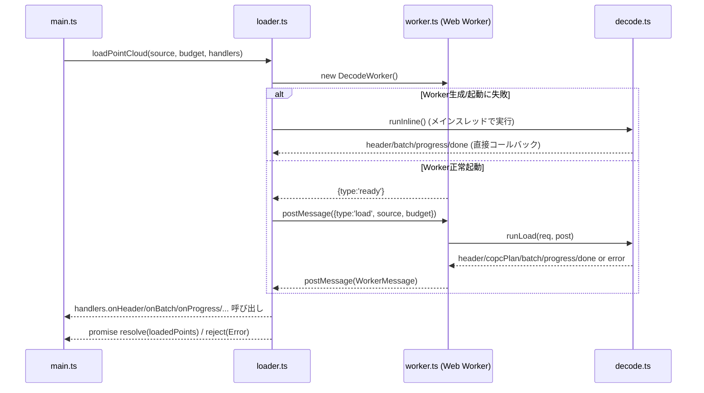
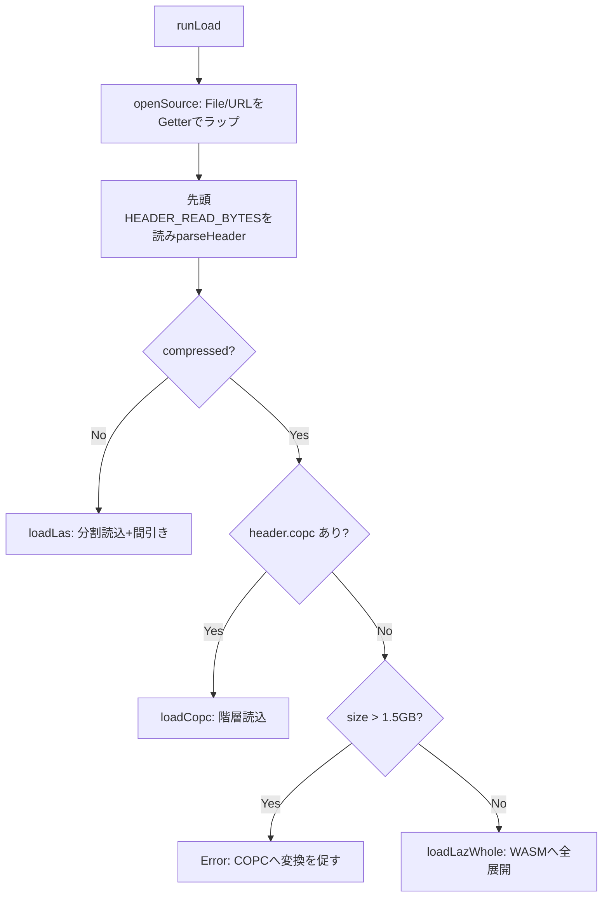
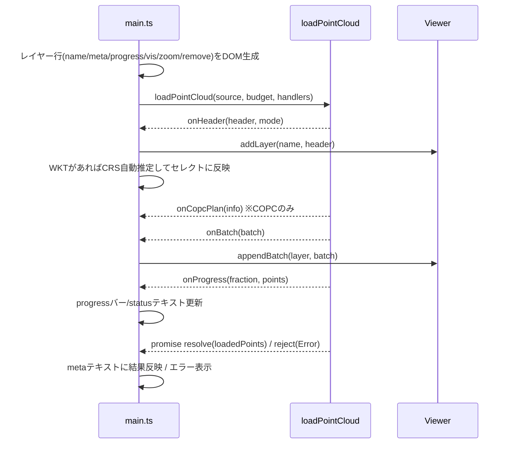
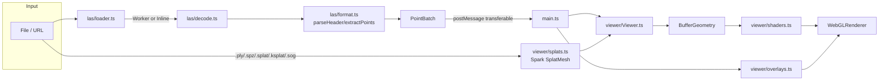

# 点群ビューア 詳細設計書

## 1. 文書の位置付け

本書は `src/` 配下の実装（2026-09 時点のソースコード）から起こした詳細設計書である。
モジュール構成、データ構造、処理フロー、シーケンスをコードと対応付けて記述する。
システム全体の目的・機能一覧・非機能要件・画面構成は
[docs/basic-design.md](basic-design.md)（基本設計書）を参照。
利用者向けの操作説明・ビルド手順は [README.md](../README.md) を参照。

## 2. システム概要

ブラウザ単体（サーバー不要）で動作する LAS / LAZ / COPC 点群ビューア（3DGS の表示にも対応）。
`vite-plugin-singlefile` により `dist/index.html` 1 ファイルへバンドルされ、
JS・WASM（laz-perf）・Worker をすべて内包する。

### 2.1 技術スタック

| 区分 | 技術 |
|---|---|
| 描画 | three.js（`WebGLRenderer` + カスタム `ShaderMaterial`） |
| 点群展開 | laz-perf（WASM 版 LASzip） |
| 座標変換 | proj4 |
| ビルド | Vite + TypeScript（`tsc --noEmit && vite build`） |
| 並列処理 | Web Worker（`?worker&inline` でバンドルに内包） |
| 3DGS 描画 | Spark（`@sparkjsdev/spark`、WASM・Worker をJSに内包） |

### 2.2 ディレクトリ構成と責務

```
src/
  main.ts            画面組み立て・イベント配線（エントリポイント）
  ui.ts              DOM生成の小ヘルパー（フレームワーク不使用）
  vite-env.d.ts       Vite用の型宣言
  las/
    format.ts        LASヘッダ/VLR/点レコードのパーサ、バッチビルダー
    messages.ts      Worker⇔メインスレッド間のメッセージ型定義
    worker.ts         Workerエントリ（decode.tsを呼び出すだけ）
    loader.ts         Workerの起動・フォールバック制御ラッパー
    decode.ts         読み込みコア処理（LAS分割/LAZ全展開/COPC階層読込）
  viewer/
    Viewer.ts         three.jsシーン管理、レイヤー、ピッキング、計測、視点制御
    shaders.ts        点描画用GLSLシェーダと共有ユニフォーム
    crs.ts            日本の座標系定義とWKTからの推定
    overlays.ts        地図タイル/3Dモデル/写真の重ね合わせ
    WalkControls.ts    ウォークスルー（一人称視点）操作
    splatPlacement.ts  3DGS の形式判定・配置計算（Spark 非依存の純粋ロジック）
    splats.ts          3DGS の読み込み（Spark `SplatMesh` の生成）
scripts/
  make_sample.py      動作確認用サンプルLAS/LAZ生成スクリプト
```

## 3. モジュール詳細設計

### 3.1 `las/format.ts` — LASヘッダ・点データの解析

#### 3.1.1 `LasHeader` インターフェース

LASヘッダから抽出する情報。バイナリオフセットは LAS 1.0〜1.4 仕様に準拠。

| フィールド | 内容 |
|---|---|
| `versionMajor/Minor` | LASバージョン |
| `pointFormat` | 点レコードフォーマット（PDRF）。圧縮ビット(0x80)を除去した値 |
| `compressed` | rawFormatの0x80ビットで判定（LAZ形式か） |
| `pointCount` | 1.4以降は64bit値（`evlrOffset`近傍）を優先採用 |
| `scale`/`offset` | 整数座標→実座標変換係数 |
| `min`/`max` | 点群のバウンディングボックス（実座標） |
| `copc` | `CopcInfo`（COPC VLRが存在する場合のみ） |
| `wkt` | 座標系のWKT文字列（`LASF_Projection`/recordId=2112のVLR） |

`HEADER_READ_BYTES = 375 + 54 + 160 + 4096` バイトを先読みし、`parseHeader()` で
シグネチャ検証・固定フィールド読み取り・VLR走査（`copc` / WKT）を行う。

#### 3.1.2 `parseHeader(buf): LasHeader`

処理フロー:
1. 先頭4バイトが `LASF` であることを確認（不一致は例外）。
2. `DataView` で固定オフセットから各フィールドを読み取る。
3. `versionMinor >= 4` かつ `headerSize >= 375` の場合、EVLRオフセット/件数と
   64bit点数を読み、`count64 > 0` なら `pointCount` を上書き。
4. `headerSize` 位置から `vlrCount` 件、VLRを順に走査:
   - `userId === 'copc'` かつ `recordId === 1` → `CopcInfo` を構築
   - `userId === 'LASF_Projection'` かつ `recordId === 2112` → WKT文字列を読み取り
5. 構築した `LasHeader` を返す。

#### 3.1.3 `layoutFor(format): FieldLayout`

PDRF（点データフォーマット）ごとにRGB・intensity・classificationのバイトオフセットを返す。

- `format >= 6`: RGBは format 7/8/10 のときオフセット30、classificationは独立バイト(オフセット16)
- `format < 6`: RGBは format 2 → offset20、format 3/5 → offset28。classificationはoffset15で下位5bitのみ使用（`classIsPdrf6=false`）

#### 3.1.4 `extractPoints(src, n, header, stride, startIndex, out)`

生の点レコード配列から `stride` 間隔で間引きながら座標・色・強度・分類を取り出し、
`PointBatchBuilder` へpushする。

- 座標は `整数値 * scale + offset - header.min` で「ファイルminを原点とした相対座標」に変換（float32格納で精度劣化を回避）。
- `startIndex % stride` で位相を合わせ、チャンク境界をまたいでも均等間引きが崩れないようにする。
- RGBが無いフォーマットは `r=g=b=255`（白）を設定。

#### 3.1.5 `PointBatchBuilder`

固定容量（`BATCH = 262,144`点）のTypedArrayに蓄積し、満杯になったら`onFlush`コールバックで
`PointBatch`（position/color/intensity/classification の各TypedArray）を発行する。
`maxColor` を追跡し、RGBが16bit値（>255）かどうかの判定に使う。

### 3.2 `las/messages.ts` — Worker通信プロトコル

`WorkerMessage` はタグ付きユニオン型で、Worker→メインスレッドの通知種別を表す。

| type | 意味 |
|---|---|
| `ready` | Worker起動完了（メインスレッドでのフォールバック判定に使用） |
| `warn` | 警告（例: 点数をファイルサイズから補正した等） |
| `header` | ヘッダ解析完了、`mode`（las/laz/copc）を通知 |
| `copcPlan` | COPC読み込み計画（使用ノード数・最大レベル）を通知 |
| `batch` | 点群バッチ（Transferableで転送） |
| `progress` | 進捗率と読み込み済み点数 |
| `done` | 完了、最終読み込み点数 |
| `error` | 例外発生、メッセージ文字列 |

### 3.3 `las/loader.ts` — Worker起動とフォールバック制御

`loadPointCloud(source, budget, handlers): { promise, cancel }`


```mermaid
sequenceDiagram
    participant Main as main.ts
    participant Loader as loader.ts
    participant Worker as worker.ts (Web Worker)
    participant Decode as decode.ts

    Main->>Loader: loadPointCloud(source, budget, handlers)
    Loader->>Worker: new DecodeWorker()
    alt Worker生成/起動に失敗
        Loader->>Decode: runInline() (メインスレッドで実行)
        Decode-->>Loader: header/batch/progress/done (直接コールバック)
    else Worker正常起動
        Worker-->>Loader: {type:'ready'}
        Loader->>Worker: postMessage({type:'load', source, budget})
        Worker->>Decode: runLoad(req, post)
        Decode-->>Worker: header/copcPlan/batch/progress/done or error
        Worker-->>Loader: postMessage(WorkerMessage)
    end
    Loader-->>Main: handlers.onHeader/onBatch/onProgress/... 呼び出し
    Loader-->>Main: promise resolve(loadedPoints) / reject(Error)
```

フォールバック判定ロジック:
- `new DecodeWorker()` 自体が例外を投げた場合 → 即座にメインスレッドで `runLoad()` を実行。
- Worker起動後、`ready` 受信前に `onerror` が発火した場合 → CSP等でWorkerが機能しない環境と判断し、
  メインスレッドにフォールバック。
- `ready` 受信後にエラーが起きた場合 → メモリ不足等とみなし、reject（フォールバックしない）。

`cancel()` は `cancelled` フラグを立てて以降のメッセージ処理を抑止し、Workerを`terminate()`する。

### 3.4 `las/worker.ts` — Workerエントリ

`self`をWorkerとして扱い、`runLoad()`を呼び出すだけの薄いラッパー。
起動直後に `{type:'ready'}` を送信し、`error`/`unhandledrejection` を捕捉して
`WorkerMessage`化することで、`file://` 環境でも詳細なエラー内容をメインスレッドへ伝える。

### 3.5 `las/decode.ts` — 読み込みコア

3つの読み込みモードを `header` から判定し分岐する（`runLoad()`）。


```mermaid
flowchart TD
    A[runLoad] --> B[openSource: File/URLをGetterでラップ]
    B --> C[先頭HEADER_READ_BYTESを読みparseHeader]
    C --> D{compressed?}
    D -- No --> E[loadLas: 分割読込+間引き]
    D -- Yes --> F{header.copc あり?}
    F -- Yes --> G[loadCopc: 階層読込]
    F -- No --> H{size > 1.5GB?}
    H -- Yes --> I[Error: COPCへ変換を促す]
    H -- No --> J[loadLazWhole: WASMへ全展開]
```

#### 3.5.1 `openSource(src): Source`

- `File` の場合: `file.slice(b,e).arrayBuffer()` で範囲読み取り。
- `string`(URL) の場合: `HEAD` リクエストで `content-length` と `accept-ranges` を確認し、
  Range非対応なら例外。`get()` は `Range: bytes=b-e-1` ヘッダ付き`fetch`。

#### 3.5.2 `loadLas()` — 通常LAS（非圧縮）の分割読込

1. `pointLength < 20` または `pointDataOffset >= size` は不正ファイルとして例外。
2. ヘッダの `pointCount` が0または `ファイルサイズから逆算した点数` を超える場合、
   ファイルサイズベースの値に補正（`warn`通知）。
3. `stride = floor(total / budget)` で均等間引き率を決定。
4. `8MB` 相当のレコード数ごとに `source.get()` でチャンク読込 → `extractPoints()` →
   進捗を `progress` で通知、を `index >= total` まで繰り返す。
5. 最後に `builder.flush()` で端数を出力。

#### 3.5.3 `loadLazWhole()` — 通常LAZの全展開

1. `laz-perf` インスタンスを遅延初期化（`wasmBinary`をfetchして`createLazPerf()`）。
2. `_malloc(size)` でWASMヒープを確保し、`64MB`ずつ`HEAPU8.set()`で書き込み（JS側に
   ファイル全体のコピーを作らずピークメモリを抑制）。
3. `LASZip` を`open()`し、`getCount()`/`getPointLength()`から`stride`を算出。
4. `65,536`点ブロック単位で `getPoint()` → `extractPoints()`。8ブロックごとに
   `progress` 通知と `yieldToEventLoop()`（`setTimeout(0)`）でUIブロッキングを回避。
5. `finally` で `blockPtr`/`filePtr`/`zip` を確実に解放。

#### 3.5.4 `loadCopc()` — COPC階層読込

1. ルート階層ページ（`info.rootHierOffset/Size`）から `parseHierarchyPage()` でエントリ抽出。
   `pointCount === -1` のエントリは他ページへの参照であり、`loadPage()` を再帰呼び出し
   （`Promise.all`で並列解決）。
2. 全ノードをレベル（`level`）ごとに集計し、レベルの浅い順に「予算 `budget` に収まるだけ」採用する
   グリーディ計画を立てる（`plan`配列、ノードごとの`stride`を決定）。
   予算を使い切るレベルでは `stride = ceil(lvPoints / remaining)` で追加間引き。
3. `copcPlan` メッセージで採用ノード数・最大レベルを通知。
4. 各ノードについて: 圧縮データ取得 → WASMへ書込 → `ChunkDecoder.open(pointFormat, len, inPtr)` →
   `getPoint()` をノードの点数分繰り返し展開 → `extractPoints()`。4ノードごとに進捗通知＋yield。

### 3.6 `viewer/shaders.ts` — 点描画シェーダ

#### 3.6.1 共有ユニフォーム `SharedUniforms`

全レイヤーの `ShaderMaterial` が同一の値オブジェクト参照を共有するため、
`Viewer` 側で一度設定すれば全レイヤーに反映される（`uMode`, `uPointSize`, `uAttenuate`,
`uScreenHeight`, `uZRange`, `uIntensityRange`, `uGamma`）。

#### 3.6.2 頂点シェーダのロジック

- `uMode` により色計算を分岐:
  - `0`（標高）: ワールドZを`uZRange`で正規化し `turbo()`（多項式近似Turboカラーマップ）を適用。
  - `1`（RGB）: 頂点カラー × `uColorScale`（8bit/16bit自動判定で1または1/257相当）を`uGamma`でガンマ補正。
  - `2`（強度）: `intensity`を`uIntensityRange`で正規化しグレースケール化。
  - `3`（分類）: `classColor()` でASPRS標準分類コードごとに固定色を返す（未分類・地面・植生・建物・水部・道路・電線等）。
- 点サイズ: `uAttenuate` が有効な場合、`-mv.z`（カメラ距離）に応じて減衰させたピクセルサイズを`clamp(1,64)`。

#### 3.6.3 フラグメントシェーダ

`uRound` が有効な場合、`gl_PointCoord` 中心からの距離が0.5を超える画素を`discard`し、
点を丸く描画する。

### 3.7 `viewer/Viewer.ts` — シーン管理の中核

#### 3.7.1 座標系設計（原点相対化）

`origin`（最初に追加したレイヤーの`header.min`、実座標・double精度）を保持し、
`toScene(x,y,z)` / `toWorld(v)` で相互変換する。GPUへ送る座標はすべて `origin` 基準の
float32相対値とすることで、平面直角座標系のような大きな絶対値でも精度劣化を防ぐ。

#### 3.7.2 レイヤー管理

- `addLayer(name, header): Layer` — 初回レイヤーで`origin`を確定。`group.position`を
  `toScene(header.min)`に設定し、`createPointMaterial()`で専用マテリアル（`SharedUniforms`共有）を生成。
  `bounds`（Box3、シーン座標）を拡張し、初回レイヤー追加時のみ`fitCamera()`を呼ぶ。
- `appendBatch(layer, batch)` — `PointBatch`から`BufferGeometry`を都度生成し`THREE.Points`として
  `layer.group`に追加（バッチ単位でGeometryを分割し、逐次描画を可能にする設計）。
  `maxColor > 255` を検出したら初回のみ `uColorScale=1`（16bit値をそのまま0..65535として扱う想定）に切替。
- `removeLayer(layer)` — Geometry/Materialを`dispose()`してから`bounds`を再計算。
- 3DGS レイヤー（`SplatLayer`）は LAS の `Layer` とは別の配列 `splatLayers` で管理する。`bounds` の再計算には
  両方を含める（[3.13.4](#3134-viewerts-の変更点)）。

#### 3.7.3 視点制御

| メソッド | 内容 |
|---|---|
| `fitCamera(box)` | 対象Boxの中心・対角長からカメラ位置・near/far・`controls.minDistance`を自動設定 |
| `setView(kind)` | `top`/`north`/`east`/`iso` の定型視点方向へジャンプ |
| `setWalkMode(on)` | `OrbitControls`⇔`WalkControls`の排他切替。ON時は`near`を0.05へ縮小、OFF時は視線5m先を`OrbitControls.target`に設定して復帰 |
| `startWalkAt(world, eyeHeight)` | クリック点(実座標)に目線高さを加えて一人称視点を開始 |

**ホイールズームの下限距離（`controls.minDistance`）**: `zoomToCursor = true`時の
`OrbitControls`は、カーソル位置中心のズームインをカメラの現在距離に**比例した**絶対移動量で
実現している。`minDistance`が既定値`0`のままだと、ズームインを繰り返して距離が十分小さくなった
時点で1回あたりの移動量が倍精度浮動小数点の丸め誤差を下回り、カメラ位置の更新が実質的に
効かなくなる（＝ズームインが反応しなくなる）不具合がある（調査:
[docs/research/5-zoom-in-stuck.md](research/5-zoom-in-stuck.md)）。これを避けるため`controls.minDistance`に
正の下限値を設定するが、当初`camera.near`と同じ比率`size / 5000`を採用したところ、
デバッグ情報パネル（`Viewer.getDebugInfo()`、後述）による実機計測で「浮動小数点の丸め誤差に
到達するはるか手前、通常のホイール操作数回で下限に到達してしまい、ズームだけでなく
`OrbitControls._pan()`の移動量（距離に比例）も潰れて右ドラッグのパンまで無反応になる」ことが
判明した。そのため`minDistanceForSize()`は`camera.near`とは切り離し、
`Math.max(1e-6, size * 1e-6)`という、浮動小数点精度崩壊（シーン比1e-15程度）に対して
十分な余裕を持たせつつ通常操作では実用上到達しない小さい比率を採用する。
`fitCamera()`で対象Boxの対角長`size`に応じて`controls.minDistance`を設定する
（未読み込み時のコンストラクタでも同じ関数で下限を初期値として設定）。`camera.near`は
デプスバッファ精度維持のため従来通り`size / 5000`のまま`minDistance`とは独立に扱う。

**ニアクリップ帯によるズーム「すり抜け」（Issue #7）**: 上記の`minDistanceForSize()`と
`camera.near = size / 5000`は独立な計算式のため、両者の比は`size`によらず常に約200倍
（`(size/5000) / (size*1e-6) = 200`）に固定される。教室スキャン程度の小さい`size`では
`near`の絶対値も数cm程度で体感されなかったが、範囲の広い点群（`size`が数千〜）では`near`が
1m前後の無視できない絶対距離になり、`distance`が`minDistance`へ到達する**はるか手前**で
`camera.near`によるニアクリップが始まり、「ズームインの終盤で点群がすり抜けて消え、その先の
空間へ飛び込んでしまう」ように見える不具合が生じることが、デバッグ情報パネルの実機計測
（`distance`が`minDistance`とほぼ一致する一方`near`はその約200倍）で判明した（調査:
[docs/research/7-zoom-in-stuck-wide-scale.md](research/7-zoom-in-stuck-wide-scale.md)）。
`minDistance`を`near`に近づける（＝結合する）と、Issue #5で問題になった「詳細を見るための
ズームインができない」不満が再発するため採用しない。代わりに、`OrbitControls`の
`change`イベント（`render()`内、カメラ・target間距離を毎フレーム参照可能な箇所）で
`camera.near`を現在距離に応じて動的に再計算する（`near = clamp(distance / 100, minDistance近傍の
下限, size / 5000)`）方式を採用し、ズームインするほど`near`も追従して縮むようにする。
`minDistance`（浮動小数点崩壊防止の下限）と`far`（`size * 50`固定）は従来どおり変更しない。

**ホイールズームの「一括ジャンプ」対策（Issue #7）**: `OrbitControls`はホイール1回分のズーム倍率を
`this._scale`に乗算で累積し、毎フレームの`update()`で一度に適用した後、`enableDamping`の設定に
関わらず無条件に`_scale`を`1`へリセットする（回転・パンの`dampingFactor`によるフレームをまたいだ
減衰はズームには適用されない）。そのため、大容量点群の読み込み処理でメインスレッドが混雑し
アニメーションフレームの間隔が伸びている間にホイール操作を行うと、その間に蓄積した複数回分の
倍率が一度の`update()`でまとめて適用され、「軽く触れただけで一気に大きくズームインする」体感を
招く。この体感は`near`とは無関係にホイールイベントの積み上がりで発生するため、`controls.zoomSpeed`
を既定値`1.0`から`0.5`へ引き下げ、1件あたりの倍率変化を緩やかにすることで、蓄積時の急激な
ジャンプを緩和する（調査: [docs/research/7-zoom-in-stuck-wide-scale.md](research/7-zoom-in-stuck-wide-scale.md)）。

マウス左ボタン押下（`onPointerDown`）は回転操作の候補かどうか（非ウォークモードかつ
Ctrl/Meta/Shiftキー非押下。押下時は`OrbitControls`側の仕様でパン操作になるため対象外）だけを記録し、
回転候補の場合は`controls.enabled = false`にして`OrbitControls`の入力処理（回転・パン・ズーム）を
一時停止する。

`OrbitControls`は`target`を変更しても`update()`内の計算上カメラの**位置**は変わらないが、
続く`object.lookAt(target)`により**向き**は強制的に`target`の方向（＝画面中央）を向く。
そのためクリック位置が画面中央でない限り、`target`を切り替えた瞬間に必ず視点の向き直りが
発生してしまい、`OrbitControls`の`target`/`lookAt`方式ではクリック位置を画面上で動かさずに
その点を中心として回転を始めることができない（調査: [docs/research/3-rotate-around-cursor.md](research/3-rotate-around-cursor.md)）。
そのため、ドラッグによる回転処理自体を独自実装に置き換えている。

実際に一定px（4px）以上動いた最初の`pointermove`（`onPointerMoveForRotatePivot`）でのみ、
`pointerdown`時点の座標を`pick()`でレイキャストし、ヒットした点を回転中心（`rotatePivot`、
ワールド座標）として記録する。ヒットしない場合は`controls.enabled = true`に戻し、通常の
`OrbitControls`回転（既存の`target`中心）に任せる。ドラッグ中の各`pointermove`
（`rotateAroundPivot(dx, dy)`）では`OrbitControls`を一切介さず、直前のポインタ位置からの
移動量だけを使って、カメラのオフセット（`camera.position - rotatePivot`）を`camera.up`まわりに
ヨー回転、続けてカメラのローカル右方向まわりにピッチ回転し、同じ回転量を`camera.quaternion`にも
適用してからカメラ位置を再計算する。`lookAt()`を呼ばないため、クリックした点が画面中央へ
強制的に移動することはない。独自回転中は`render()`内の`controls.update()`呼び出し自体を
スキップする（`update()`は毎フレーム無条件で`lookAt(target)`を呼ぶため、呼ぶと独自に設定した
向きが上書きされてしまう）。

`onPointerUp`では、独自回転を行っていた場合は`controls.target`を**カメラの現在の正面方向**上の
点に置き直してから（この点は定義上すでに画面中央にあるため`lookAt()`を呼んでも向きは変化しない）
`controls.enabled = true`に戻す。ドラッグに至らなかった単純クリックの場合は`target`を変更せず、
`onPick`コールバックに`pick()`の結果を渡すのみとする（後述のとおり、`target`をクリック地点へ
更新する方式は一度採用したが、副作用のため撤回した）。

この置き直し先の距離（`camera.position`から回転前の`target`までの距離）は、`rotatePivot`を
中心に回転した結果カメラが古い`target`の近くをかすめると0に近づくことがあり、そのまま採用すると
以降の`OrbitControls`のズーム・パンが距離に比例した移動量計算のため実質的に反応しなくなる
（調査: [docs/research/5-zoom-in-stuck.md](research/5-zoom-in-stuck.md)）。これを防ぐため、
`controls.minDistance`を下限としてクランプしてから`target`を置き直す
（`computeTargetAfterRotate()`として純粋関数に切り出し、ユニットテストで検証する）。

**ダブルクリックによるクリック位置基準のズーム（Issue #7）**: `zoomToCursor = true`はズームの
**方向**をカーソル位置に追従させるのみで、1回あたりの歩幅は常に`OrbitControls`内部の
`_spherical.radius`（カメラ・`target`間の距離）に比例する。広範囲点群では`target`がフィット時の
シーン中心に固定されがちで、ユーザーが実際に操作したい領域から離れているほど`zoomSpeed`を
下げても歩幅が意図通りにならないことが実機検証で判明した（調査:
[docs/research/7-zoom-in-stuck-wide-scale.md](research/7-zoom-in-stuck-wide-scale.md)）。
そこでPotreeViewer等と同様に、`dblclick`イベント（`onDoubleClick()`）でヒットした地点までの
距離を半分に縮める形でカメラを移動する（`minDistance`未満にはしない）ダブルクリックズームを
追加した（`computeDoubleClickZoomPosition()`として純粋関数に切り出し、ユニットテストで検証）。
瞬時に移動すると視点が把握しづらいため、`easeOutCubic()`による減速イージングでカメラ位置・
`target`を約300msかけて補間するアニメーションにしている。

当初は`target`をクリック地点そのものに設定していたが、`OrbitControls.update()`が毎フレーム
無条件で呼ぶ`camera.lookAt(target)`により、クリックした点が画面中心へスナップしてしまい
不自然だった（`onPointerUp`での単純クリックでも同様に`target`を更新する設計を一度採用したが、
同じ理由で撤回した）。現在は視線方向（`camera.getWorldDirection()`）を変えず、その方向に沿って
カメラを前進させるだけにし、`target`もクリック地点ではなく「ズーム後のカメラ位置からクリック
地点までの距離だけ、視線方向に進んだ点」に置く。これによりクリックした点は画面上の同じ位置に
留まったままズームし（ホイールの`zoomToCursor`と同じ見え方）、アニメーション完了後に
`OrbitControls`の`lookAt(target)`が実行されても向きは変化しない（詳細:
[docs/research/7-zoom-in-stuck-wide-scale.md](research/7-zoom-in-stuck-wide-scale.md)の
追加調査4・5。イベント配線自体はWebGL依存のため[CONTRIBUTING.md](../CONTRIBUTING.md) §6の
例外規定によりテスト対象外）。

**カメラ・target間距離の防御的な再クランプ（Issue #7 追加調査3）**: 上記の対策後も、実機で
ズームを繰り返すと`camera.position`・`controls.target`間の距離が`minDistance`を大きく
下回り（実測: `distance`が`minDistance`の1/100万以下）、以降ズームイン・パン・ダブルクリック
ズームのいずれも反応しなくなる現象を確認した。`OrbitControls`は内部で`_clampDistance()`により
距離を`[minDistance, maxDistance]`にクランプしているが、`zoomToCursor`有効時はカーソル方向への
レイに沿ってカメラ位置を直接動かす経路があり、`target`を外部から任意に書き換える本実装と
組み合わさるとこのクランプ後もなお不変条件（`distance >= minDistance`）が崩れる場合がある
（内部メカニズムの完全な特定には至っていないため、[docs/research/7-zoom-in-stuck-wide-scale.md](research/7-zoom-in-stuck-wide-scale.md)
の追加調査3では仮説として記載）。根本原因の特定を待たず、`render()`で`controls.update()`の
直後に`camera.position`・`target`間距離を再計算し、`minDistance`未満であれば同じ方向を保ったまま
`minDistance`まで押し戻す防御的なクランプ（`clampCameraDistance()`）を追加した。これは
Issue #5で採用した`computeTargetAfterRotate()`と同じ設計思想（不変条件をカメラ・targetの
どちらかの側から強制的に保証する）を、毎フレームの防御として適用したものである。

**デバッグ情報パネル（`getDebugInfo()` / `onDebugUpdate`）**: Issue #5の調査で、ソースコード解析に
基づく修正が実機では効果を確認できないという事態が続いたため、`render()`内で毎フレーム
カメラ位置・`target`・両者の距離・`minDistance`・`controls.enabled`・回転操作の内部状態
（`rotateCandidate`/`rotateActive`）をまとめた`ViewerDebugInfo`を`getDebugInfo()`で取得できるようにし、
Issue #7の調査では`near`/`far`（`camera.near`/`camera.far`）と`sceneSize`（読み込み済み点群全体の
バウンディングボックス対角長）も追加し、ニアクリップとの関係を実機で確認できるようにした。
`onDebugUpdate`コールバック経由で[src/main.ts](../src/main.ts)側へ通知する。UI側はツールバーの
「デバッグ情報」ボタンで画面左上に表示のON/OFFを切り替えられる。WebGLコンテキストに依存し
jsdom環境での単体テストが困難なため、`getDebugInfo()`自体はユニットテスト対象外とする
（[CONTRIBUTING.md](../CONTRIBUTING.md) §6の例外規定に基づく）。

#### 3.7.4 ピッキング（`pick()`）

`Raycaster.params.Points.threshold` を「注視点距離の約6px相当」に動的設定して点群をレイキャスト。
点群ヒットは距離順に整列されないため、最も近いヒット距離から`camDist*0.02`以内の範囲で
`distanceToRay`が最小のヒットを採用する（手前の点を優先しつつレイに最も近い点を選ぶ工夫）。
レイキャスト対象は LAS レイヤーの `group` のみで、3DGS レイヤーは含めない（[3.13.7](#3137-スコープ外既知の制約)）。

#### 3.7.5 距離計測

`measureMode`中に2点クリックすると`addMeasurement(a,b)`で線分・ラベル（Canvasテクスチャの
`Sprite`）を生成し、3D距離・水平距離・高低差を`onMeasure`コールバックへ通知する。
ラベル/マーカーは`worldPerPixel()`を用い、画面上で一定ピクセルサイズを保つようフレームごとに
スケール再計算する。

### 3.8 `viewer/WalkControls.ts` — ウォークスルー操作

Z-up前提。`yaw`（Z軸回転）・`pitch`（仰俯角）を内部状態として保持し、`viewDir`から
`camera.lookAt()`で姿勢を反映する。

- `update()`: `keys`（押下中キー集合）とdt（前フレームからの経過秒）から移動量を積分。
  `Shift`で3倍速、水平移動（W/S/A/D）はXY平面上、R/Fで高さのみ変更。
- マウス左ドラッグで`yaw`/`pitch`を直接操作（`0.004 rad/px`）。
- ホイールで視線方向への前後移動。
- `Escape`キーで`onExit`コールバック（`Viewer.setWalkMode(false)`に接続）を発火。
- `isTyping()`でinput/select/textareaへのフォーカス中はキー操作を無視。

### 3.9 `viewer/crs.ts` — 座標系定義

- 平面直角座標系 I〜XIX系の原点緯度経度をハードコードし、`+proj=tmerc`（Transverse Mercator,
  `k=0.9999`）のproj4定義文字列を生成。JGD2011（EPSG:6669〜）とJGD2000（EPSG:2443〜）の
  両方を用意。
- UTM 51〜55帯（JGD2011 / WGS84）とWebメルカトル（EPSG:3857）も定義。
- `Crs`クラス: `proj4(WGS84, def.proj)`で変換器を構築し、`swapXY`（測量座標系のX=北/Y=東）
  設定に応じて`toLocal()`/`toLonLat()`で軸を入れ替える。
- `guessCrsFromWkt(wkt)`: WKT末尾の`ID["EPSG",n]`または`AUTHORITY["EPSG","n"]`から
  EPSGコードを正規表現抽出、一致する定義を返す。系番号のみの場合はJGD2011系から名称一致で推定。

### 3.10 `viewer/overlays.ts` — 重ね合わせ機能

#### 3.10.1 `MapOverlay`

1. `build(crs, source, zScene, margin, maxTiles)` で点群バウンディングボックス（+余白20%）の
   4隅を`crs.toLonLat()`で経緯度化し、包含する経緯度範囲を算出。
2. `maxTiles`（既定64枚）に収まる最大ズームレベルを、`source.maxZoom`から降順に探索して決定。
3. 各タイルは`PlaneGeometry(1,1,6,6)`（6x6分割）を生成し、各頂点をタイル内座標→経緯度→
   `crs.toLocal()`で点群のローカル座標へ逆変換して配置することで、地図投影の歪みに追従させる。
4. `TextureLoader`で非同期にタイル画像を読み込み、読み込み完了後にマテリアルへ反映。

#### 3.10.2 `ModelOverlay`（glb/gltf/obj）

- `GLTFLoader`/`OBJLoader`で読み込み、`inner`グループ（Y-up→Z-up変換用の中間ノード）に格納。
- `centerOnBase(yUp)`: モデルのローカルBoxを計算し、XY中心・Z（またはY-upならY）の最小値を
  原点に合わせることで「底面中心」を基準点にする。
- `setPlacement()`: 実座標→シーン座標変換、スケール、方位角（Z軸回転）、Y-up/Z-up切替
  （`inner.rotation.x = Math.PI/2` or `0`）を適用。

#### 3.10.3 `PhotoOverlay`（jpg/png）

`PlaneGeometry(1,1)`にテクスチャを貼り、`width`と画像アスペクト比から高さを算出。
方位角・傾き・不透明度をプレーンの回転・マテリアル`opacity`に反映する想定
（`setPlacement()`, ファイル末尾は読み取り範囲外だが`MapOverlay`/`ModelOverlay`と同様の
実座標→シーン座標変換パターンに従う）。

### 3.11 `main.ts` — 画面組み立てとイベント配線

DOM要素（`#panel`, `#canvas`, `#status`, `#coord`, `#toolbar`等）を取得し、`Viewer`と
3種の`*Overlay`をインスタンス化した上で、`ui.ts`のヘルパーでセクションごとのUIパネルを
組み立てる。責務ごとに以下のセクションに分割:

| セクション | 主な機能 |
|---|---|
| ファイル | ドラッグ&ドロップ/ファイル選択/URL読込、表示点数上限、レイヤー一覧（可視・ズーム・削除） |
| 表示 | 色分けモード、点サイズ・減衰、標高/強度レンジ、RGBガンマ、背景色 |
| ウォークスルー | 開始/終了、移動・旋回速度、目線高さ |
| 距離計測 | 計測モード切替、結果一覧、消去 |
| 地図の重ね合わせ | 座標系選択、タイル種別、高さオフセット、不透明度 |
| 3Dモデルの重ね合わせ | ファイル読込、位置・倍率・方位角・Y-up設定 |
| 写真の重ね合わせ | ファイル読込、位置・幅・方位角・傾き・不透明度 |

ファイル選択・ドラッグ&ドロップ・URL 指定で受け取ったソースは、`isSplatSource()`（[3.13.2](#3132-viewersplatplacementts--純粋ロジック)）で
3DGS かどうかを判定し、3DGS なら `addSplatSource()`、それ以外は従来どおり `addSource()` に振り分ける。

#### 3.11.1 `addSource(source, name)` の処理フロー


```mermaid
sequenceDiagram
    participant UI as main.ts
    participant Loader as loadPointCloud
    participant Viewer as Viewer

    UI->>UI: レイヤー行(name/meta/progress/vis/zoom/remove)をDOM生成
    UI->>Loader: loadPointCloud(source, budget, handlers)
    Loader-->>UI: onHeader(header, mode)
    UI->>Viewer: addLayer(name, header)
    UI->>UI: WKTがあればCRS自動推定してセレクトに反映
    Loader-->>UI: onCopcPlan(info)  ※COPCのみ
    Loader-->>UI: onBatch(batch)
    UI->>Viewer: appendBatch(layer, batch)
    Loader-->>UI: onProgress(fraction, points)
    UI->>UI: progressバー/statusテキスト更新
    Loader-->>UI: promise resolve(loadedPoints) / reject(Error)
    UI->>UI: metaテキストに結果反映 / エラー表示
```

- `refreshRanges()`: 標高レンジ入力欄（ユーザー未編集時のみ）や3Dモデル/写真の初期配置座標
  （点群バウンディングボックス中心）を自動更新。
- 「上限を適用して再読込」ボタンは全エントリを`removeEntry()`→`addSource()`で作り直す。

### 3.12 `ui.ts` — DOMヘルパー

フレームワーク不使用で、`el()`（属性・子要素付きDOM生成）、`section()`（`<details>`折りたたみ）、
`slider()`/`numberInput()`/`select()`/`checkbox()`/`button()`/`fileButton()` の各コンポーネントを
関数として提供する。状態はクロージャで保持し、`onChange`コールバックで呼び出し側に通知する
薄いラッパーパターン。

### 3.13 `viewer/splats.ts` — ガウシアンスプラット（3DGS）表示

調査・検証結果は [docs/research/12-gaussian-splatting.md](research/12-gaussian-splatting.md) を参照（Issue #12）。

#### 3.13.1 方式とモジュール構成

- 描画ライブラリには Spark（`@sparkjsdev/spark`、バージョンは `2.2.0` に固定）を使う。
  `SparkRenderer` を `Viewer.scene` に 1 つ追加し、各ファイルを `SplatMesh` として scene に追加する。
  スプラットの深度ソートは Spark が Worker で行う。
- Spark に依存するコードと、依存しない純粋ロジックを分ける（単体テストで Spark/WebGL/WASM を読み込まないため）。

| ファイル | 責務 | Spark 依存 |
|---|---|---|
| `viewer/splatPlacement.ts` | 形式判定、軸変換、実座標/ローカルの判定、配置（位置・回転・倍率）の計算 | なし（three.js の数学クラスのみ） |
| `viewer/splats.ts` | バイト列から `SplatMesh` を生成し、読み込み完了を待ってローカル座標の範囲とスプラット数を返す | あり |
| `viewer/Viewer.ts` | `SparkRenderer` の保持、3DGS レイヤーの追加・削除・表示切替・配置反映、`bounds` への反映 | あり（型と `SparkRenderer` のみ） |
| `main.ts` | 読み込みの振り分け、レイヤー行と配置 UI | なし（`splats.ts` 経由） |

#### 3.13.2 `viewer/splatPlacement.ts` — 純粋ロジック

```ts
export const SPLAT_EXTENSIONS = ['.ply', '.spz', '.splat', '.ksplat', '.sog'];
/** ファイル名または URL（クエリ・フラグメントは除く）の拡張子で 3DGS かを判定。大文字小文字は区別しない */
export function isSplatSource(nameOrUrl: string): boolean;

/** ファイル内の座標軸の向き。Y-down は OpenCV/COLMAP 系（3DGS の学習結果に多い） */
export type SplatAxis = 'z-up' | 'y-up' | 'y-down';
/** ファイル座標 → Z-up（シーン）への回転 */
export function axisToZUp(axis: SplatAxis): THREE.Quaternion;

/** ファイル座標の範囲の中心が水平方向に 10,000m 以上離れていれば、実座標で記録されたデータとみなす */
export const GEOREF_THRESHOLD = 10_000;
export function isGeoreferenced(localBox: THREE.Box3): boolean;

export interface SplatPlacement {
  mode: 'world' | 'local';
  axis: SplatAxis;       // world モードでは 'z-up' 固定
  x: number; y: number; z: number; // local モード: 基準点を置く実座標
  scale: number;         // local モードのみ
  headingDeg: number;    // local モードのみ（Z 軸まわり）
}
/** 読み込み直後の初期配置 */
export function defaultPlacement(localBox: THREE.Box3, sceneBounds: THREE.Box3, origin: [number, number, number] | null): SplatPlacement;
/** SplatMesh に設定する position / quaternion / scale を求める */
export function computeSplatTransform(p: SplatPlacement, localBox: THREE.Box3, origin: [number, number, number]): {
  position: THREE.Vector3; quaternion: THREE.Quaternion; scale: THREE.Vector3;
};
/** 配置後のシーン座標での範囲（bounds 計算用） */
export function splatSceneBox(localBox: THREE.Box3, t: ReturnType<typeof computeSplatTransform>): THREE.Box3;
```

配置の考え方:

- **world（実座標）モード**: ファイル内の座標をそのまま実座標（Z-up）として扱う。
  `position = -origin`、回転なし、倍率 1。これで既存の「シーン座標 = 実座標 - origin」（[3.7.1](#371-座標系設計原点相対化)）と一致する。
- **local（ローカル）モード**: 3D モデル重ね合わせ（[3.10.2](#3102-modeloverlayglbgltfobj)）と同じ考え方で配置する。
  1. `axisToZUp(axis)` で Z-up に回した後の範囲の「底面中心」（XY 中心・Z 最小）を基準点とする。
  2. 変換は `シーン座標 = T(toScene(x,y,z)) · Rz(heading) · S(scale) · Q(axis) · T(-基準点のファイル座標)`。
- `defaultPlacement()`:
  - `isGeoreferenced(localBox)` なら world モード。
  - それ以外は local モード（`axis: 'y-down'`, `scale: 1`, `headingDeg: 0`）とし、既存の `bounds` があればその底面中心、
    なければ実座標 `(0,0,0)` に基準点を置く。

#### 3.13.3 `viewer/splats.ts` — 読み込み

```ts
export interface LoadedSplat { mesh: SplatMesh; localBox: THREE.Box3; splatCount: number; }
export async function loadSplatMesh(bytes: Uint8Array, fileName: string): Promise<LoadedSplat>;
```

- `new SplatMesh({ fileBytes: bytes, fileName, extSplats: true })` で生成し、`await mesh.initialized` の後に
  `mesh.getBoundingBox()` でファイル座標の範囲を取得する。
- **`extSplats: true` は必須**。標準形式は中心座標が float16 のため、実座標（数万 m）では位置が破綻する
  （PoC で半径 2m の球が 1 本の線に潰れることを確認済み）。
- 形式は `fileName` の拡張子から Spark が判定する。

#### 3.13.4 `Viewer.ts` の変更点

```ts
export interface SplatLayer {
  id: number; name: string; mesh: SplatMesh; localBox: THREE.Box3;
  placement: SplatPlacement; splatCount: number; visible: boolean;
}
readonly splatLayers: SplatLayer[];
addSplatLayer(name: string, loaded: LoadedSplat): SplatLayer;
setSplatPlacement(layer: SplatLayer, p: SplatPlacement): void;
setSplatLayerVisible(layer: SplatLayer, v: boolean): void;
removeSplatLayer(layer: SplatLayer): void;
fitToSplatLayer(layer: SplatLayer): void;
```

- `SparkRenderer` は最初の `addSplatLayer()` のときに生成して scene に追加する（3DGS を使わないときの負荷をなくすため）。
- `addSplatLayer()`:
  1. `defaultPlacement()` で初期配置を決める。
  2. `origin` が未確定で world モードなら、`origin = localBox.min`（LAS の `header.min` と同じ扱い）とする。
     local モードでは `origin` を確定させない（後から読む LAS の精度を守るため）。
  3. `computeSplatTransform()` を mesh に反映し、`recomputeBounds()`。最初のデータ（LAS・3DGS 含めて）なら `fitCamera()`。
- `recomputeBounds()` は LAS レイヤーに加えて `splatSceneBox()` の結果を含める。これにより `fitCamera()`・`setView()`・
  near/far・`minDistance` の計算がスプラットにも効く。
- `removeSplatLayer()` は scene から外して `mesh.dispose()`。最後の 3DGS レイヤーが消えても `SparkRenderer` は残す。
- **origin が後から確定した場合**: local モードの配置は実座標で持っているため、`addLayer()` で `origin` が確定したら、
  全 3DGS レイヤーに `computeSplatTransform()` を再適用する（`origin` 未確定の間は `(0,0,0)` として計算している）。

#### 3.13.5 `main.ts` の変更点

- ファイル入力の `accept` とドロップ領域の案内文に `.ply,.spz,.splat,.ksplat,.sog` を追加する。
- `addSplatSource(source: File | string, name)`:
  1. レイヤー一覧に行を追加（可視チェック・ズーム・削除は LAS と同じ）。メタ情報は `3DGS / N スプラット`。
  2. File は `arrayBuffer()`、URL は `fetch()` で全体を取得する（Range 読込はしない）。URL の場合は
     `Content-Length` があれば進捗バーを更新する。
  3. `loadSplatMesh()` → `viewer.addSplatLayer()`。
  4. 行内に折りたたみの「配置」（`<details>`）を置く。項目は、モード表示、軸の向き（Z-up / Y-up / Y-down）、
     X/Y/Z、倍率、方位角、「クリック点に配置」。world モードでは軸・倍率・方位角を無効化する。
     変更時は `viewer.setSplatPlacement()` を呼ぶ。
- `?url=` パラメータ・URL 入力欄も `isSplatSource()` で振り分ける。

#### 3.13.6 テスト方針（TDD）

| 対象 | テスト内容 |
|---|---|
| `isSplatSource` | 各拡張子、大文字、URL のクエリ付き、`.las`/`.laz`/`.copc.laz` が false |
| `axisToZUp` | 各軸で、ファイルの「上」方向ベクトルが (0,0,1) に写ること |
| `isGeoreferenced` | しきい値の前後、負の座標 |
| `defaultPlacement` | 実座標データ → world、ローカルデータ → local かつ既存 bounds の底面中心に配置、bounds なし → (0,0,0) |
| `computeSplatTransform` | world: position=-origin。local: 基準点が指定実座標に来る、倍率・方位角・軸変換の組合せ |
| `splatSceneBox` | 変換後の範囲が期待値と一致 |
| `Viewer` の bounds | 3DGS レイヤー込みの bounds 計算（純粋関数に切り出してテスト） |

`splats.ts`（Spark・WASM・WebGL が必要）と UI 配線は単体テストの対象外とし、動作確認（Playwright で `file://` 起動、
実データの PLY/SPZ 読込、点群との同時表示）で確認する。

#### 3.13.7 スコープ外・既知の制約

- クリックでの座標取得・距離計測はスプラットを対象外とする（段階 4 として別 Issue で扱う）。
  スプラットの上をクリックした場合は、背後にある点群がヒットする。
- 色分けモード・点サイズ・減衰などの「表示」設定はスプラットに適用しない。
- ファイル全体をメモリに読み込む（LOD・部分読込なし）。大きなデータには圧縮率の高い `.spz` / `.sog` を推奨する。
- 位置精度は float32 相当（4万m 付近で約 4mm）。表示用途としては十分と判断した。

## 4. データフロー図（全体）


```mermaid
flowchart LR
    subgraph Input
      F[File / URL]
    end
    F --> Loader[las/loader.ts]
    Loader -->|Worker or Inline| Decode[las/decode.ts]
    Decode --> Format[las/format.ts\nparseHeader/extractPoints]
    Format --> Batch[PointBatch]
    Batch -->|postMessage transferable| Main[main.ts]
    Main --> Viewer[viewer/Viewer.ts]
    Viewer --> Geom[BufferGeometry]
    Geom --> Shader[viewer/shaders.ts]
    Shader --> GPU[WebGLRenderer]
    Main --> Overlays[viewer/overlays.ts]
    Overlays --> GPU
    F -->|.ply/.spz/.splat/.ksplat/.sog| Splats[viewer/splats.ts
Spark SplatMesh]
    Splats --> Viewer
```

## 5. エラーハンドリング方針

| 発生箇所 | 方針 |
|---|---|
| ヘッダ不正（非LAS） | `parseHeader()`で例外→`decode.ts`が`describeError()`で整形→`error`メッセージ |
| 点数0/過大 | ファイルサイズから補正し`warn`で通知（処理は継続） |
| Worker起動不可（CSP等） | `loader.ts`がメインスレッド実行にフォールバック（`onFallback`で画面通知） |
| Worker異常終了（メモリ不足等） | `reject`し、UIで「表示点数上限を下げて再読込」を案内 |
| 通常LAZが1.5GB超 | `decode.ts`が事前に例外化し、COPC変換コマンド例を提示 |
| Range非対応サーバー | `openSource()`のHEADレスポンス確認時点で例外化 |
| 地図/座標系変換不正 | `MapOverlay.build()`で`isFinite`/緯度範囲チェックし例外化、UI側でstatus表示 |
| 3DGS ファイル不正・非対応形式 | `loadSplatMesh()`が`SplatMesh.initialized`の reject を受けて例外化し、レイヤー行にエラー表示（点群と同じ表示形式） |
| 3DGS の URL 取得失敗 | `fetch`の HTTP エラー / CORS エラーを例外化し、レイヤー行にエラー表示 |

## 6. 既知の制約・設計上のトレードオフ

- 通常LAZはWASMメモリへ全展開する都合上、**1.5GBを実装上の上限**としている（COPC変換を代替手段として案内）。
- 点群の間引きは「ファイル内の均等ストライド」であり、密度ベースの最適化は行っていない。
- COPCの間引きはノード（レベル）単位の粗い制御であり、レベル内はストライド間引きのみ。
- 座標精度は「原点相対 + float32」で確保しているため、複数ファイルの原点は最初のレイヤーに統一される
  （2つ目以降のレイヤーはこの`origin`を基準に再配置される）。
- ガウシアンスプラット（3DGS）はクリックでの座標取得・距離計測の対象外（[3.13.7](#3137-スコープ外既知の制約)）。
  また色分けモード・点サイズ等の「表示」設定はスプラットには適用されない。
- 3DGS は Spark の拡張形式（float32）で保持するため、実座標モードの位置精度は float32 の量子化幅
  （絶対値 4万m 付近で約4mm）に制限される（[docs/research/12-gaussian-splatting.md](research/12-gaussian-splatting.md)）。
- Spark を内包するため、単一 HTML のサイズは約 1.5MB → 約 4.2MB に増える。

## 7. デプロイ構成（GitHub Pages）

調査結果は [docs/research/1-github-pages-deploy.md](research/1-github-pages-deploy.md) を参照。

- `.github/workflows/deploy-pages.yml` にて、`main`へのpush（および`workflow_dispatch`）を
  トリガーに `npm ci && npm run build` を実行し、`dist/`を
  `actions/upload-pages-artifact` → `actions/deploy-pages` でGitHub Pagesへデプロイする。
- リポジトリ設定の **Pages Source は「GitHub Actions」** を選択する
  （`main`ブランチの`/docs`や`gh-pages`ブランチは使わない。設計書フォルダ`docs/`との衝突を避けるため）。
- `vite.config.ts`の`base: './'`と`vite-plugin-singlefile`による単一HTML化により、
  GitHub Pagesのプロジェクトサブパス配下でも追加設定なしで動作する。
- ワークフローの`actions/setup-node`は`vite@^7`が要求するNode 20.19+/22.12+を満たすため
  `node-version: 22`を指定する。

